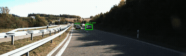
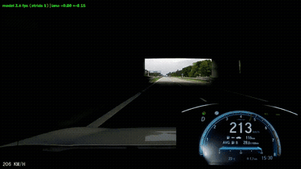

# Driving Risk Analyzer

A computer vision system that analyzes dashcam video to do one thing well: detect and track vehicles, identify the lead vehicle, estimate time-to-collision (TTC), and flag a rapid-closing event.

Portfolio project built to be explainable end-to-end, not just demoed: every design decision, tradeoff, and failure mode below is backed by a real experiment, logged as it happened in [`NOTES.md`](NOTES.md).

**Not a safety system.** A research/portfolio prototype, not something to rely on while driving.

## Status

Detection, tracking, lead-vehicle selection, and Kalman-filtered TTC are working on real footage, with a real bug found and fixed (see below). This is a deliberately narrowed scope (as of 2026-09-29) — an earlier, larger version of this project also did GPS-based distance/headway/speeding detection and a formal quantitative evaluation against KITTI ground truth. That work was real, completed, and validated, but got dropped to put full effort into the one thing that actually gets watched: the annotated video. See `NOTES.md` for the full account and what's kept vs. frozen.

## Demo

Two clips, same pipeline, proving it's camera-independent — no KITTI-specific code involved in either. Full videos are in `outputs/` (not committed — see below); the GIFs here are short excerpts for a quick look.

**KITTI Autobahn (sequence 0020)** — picked after screening all 21 KITTI tracking sequences and visually checking candidates, not just the first one downloaded (see `NOTES.md`, 2026-09-28). Excerpt below shows a real rapid-closing flag around t=76s.

**Autobahn braking clip** — a real downloaded dashcam clip (no KITTI dependency at all), showing a genuine near-collision: filtered TTC bottoms out at **1.03s** while overtaking a VW Golf, sustained long enough to trip the rapid-closing banner (t=15.0-16.3s; a separate, even closer moment on a different car bottoms at 0.68s but is too brief to sustain the flag — see Known Limitations). Also shows the system correctly recognizing when a car leaves the same lane (a real lane-change during the clip's emergency maneuver) and stopping the lead label rather than keeping a stale, wrong pick — see `NOTES.md`, 2026-09-29.

Both show boxes, tracking, the lead highlight, TTC, and a red RAPID CLOSING warning banner — `live.py`'s streaming overlay and `kitti_annotate.py`'s offline renderer now share one detector for it (`RapidClosingDetector` in `lead_ttc.py`, added 2026-09-30). The lead box and TTC readout also escalate visually as TTC drops — green when safe, yellow under 4s, red and larger under 2s (`lead_ttc.ttc_urgency`, shared by both renderers, 2026-09-30) — so the number that matters most draws the eye right when it matters, without adding any new measurement or claim. Getting the banner to actually fire on the autobahn clip surfaced a real bug in lead selection, not just a threshold to tune — see "A real bug, found and fixed" below. Lane-band guide lines (useful while diagnosing that bug) were removed from both finished renderers — a viewer doesn't need to see the selection internals, just the result.

A third clip (a single-lane street dashcam recording) was tried but didn't produce a usable demo — see `NOTES.md`, 2026-09-29/30. The final lineup is these two clips.

## A real bug, found and fixed

Watching this video surfaced a real problem: in the first ~15 seconds, the lead-vehicle pick sometimes looked wrong — landing on a car in an adjacent lane instead of the obviously-in-front traffic. Investigated concretely rather than patched blindly:

- The lead-selection "lane band" (a fixed ±10% of frame width, tuned on an earlier single-lane clip) let an adjacent-lane car outrank true same-lane traffic on this wide multi-lane highway, since a close, big adjacent-lane box can still land inside a rigid central band.
- Checked whether this was a camera-calibration issue first (read the real principal point from KITTI's calibration file) — ruled out, only ~1% off-center.
- Fixed by tuning the band width against ground truth (`kitti_band_tune.py`: run the exact same lead-selection algorithm on real KITTI 3D-label boxes as a reference, grid-search the band width, score by agreement) rather than guessing a number. Verified the fix on the exact complained-about window: agreement with ground truth went from 77.4% to 96.7% in the first 15 seconds.
- One frame that still looked "wrong" after the fix was double-checked against ground truth directly — it turned out to be the objectively correct pick (a small, distant car that looks visually counter-intuitive as "the lead" without seeing the geometry), not a remaining bug. Worth stating plainly: my own first reaction to that frame was wrong, and I caught it by checking rather than trusting the reaction.

**A second round of the same bug, found while adding the rapid-closing banner (2026-09-30).** Wiring `RapidClosingDetector` into `live.py` and testing it on the autobahn clip, the flag never fired despite an obvious, sustained near-miss on screen. First guess was a threshold problem (the cold-start trust guard); grid-searching that against KITTI ground truth found no honest fix (see Known Limitations). The real cause, found by dumping every raw detected box (not just the already-filtered lead output): the closing car sat at 0.071–0.081 fractional deviation from center for over 4 seconds while visibly growing from 18px to 180px wide — just outside the 0.07 band, so `LeadSelector` never picked it up until the last ~1 second before closest approach. Confirmed by re-running the actual `LeadSelector` → `TTCKalman` → `RapidClosingDetector` pipeline end to end at several band widths, not just checking raw position (an early check of raw deviation alone wrongly suggested 0.075 was enough — simulating the real pipeline showed other legitimate cars grab the lead in a gap at 0.075, splitting the stint in two). `BAND_HALF_WIDTH` retuned 0.07 → 0.08 (`kitti_band_tune.py`, re-run with the wider candidate): a small, honest tradeoff — KITTI pooled agreement dips slightly (0.798 → 0.790; sequence 0009 actually improves, 0020 dips a little) — accepted because it's what makes the banner correctly fire on a genuine near-miss. Re-rendered both demo videos.

## Scope

Lead-vehicle detection targets **steady same-lane following** — highway-style closing, tailgating, rapid approach. It is not designed to identify or predict cross-traffic, merges, cars pulling out of driveways, or other vehicles' turning intent. That's a real trajectory/intent-prediction problem, and a much bigger one than this project takes on.

This boundary was found concretely, not assumed up front: investigating real KITTI driving sequences for a TTC ground-truth check turned up several plausible-looking "closing vehicle" tracks that turned out to be a parked car being driven past closely, or a car merging in from a driveway — not a lead vehicle. The lead-selector correctly ignoring these is the system working as scoped, not a gap.

## Known limitations (found and root-caused, not guessed at)

Each of these was found by testing against real data — either real footage or KITTI's ground-truth 3D labels — and root-caused before being written down here. Full details, numbers, and the plots behind each one are in `NOTES.md`.

**1. Box-width TTC breaks down when the box is clipped by the frame edge — exactly at the closest, most dangerous range.**
TTC is estimated from how fast a vehicle's bounding box grows (`TTC ≈ width / (d width/dt)`). When a car gets close enough to start exiting the frame, its *labeled* box (checked against KITTI ground truth) can shrink even while the car keeps closing, because it's being clipped rather than shrinking/growing with the car's true extent. Naively trusting that measurement makes the filter report TTC *increasing* right when it should be at its lowest. Mitigated by detecting edge-truncation and freezing the filter's measurement update on those frames (coast on the last trusted rate) — this stops the filter from reporting the wrong direction, but it does not recover the lost information. An inherent blind spot of box-width TTC at the closest ranges, not a tuning problem.

**2. Occlusion breaks tracker ID continuity, which resets the TTC filter.**
On a real KITTI sequence, a car passing behind another object for roughly 1–4 seconds caused the tracker (ByteTrack) to assign it a new ID once it reappeared. Each ID change resets the Kalman filter's running estimate, since a new ID might be a different vehicle. This is a genuine cost of occlusion in real footage, not specific to KITTI.

**3. A lead-vehicle switch resets the TTC filter's state.** When `LeadSelector` switches to a different tracked vehicle — a legitimate call when several real vehicles are plausible candidates, not just an occlusion ID-switch — `TTCKalman` intentionally restarts from scratch. A guard (`MIN_TRUST_AFTER_SWITCH_S`, 1.0s) suppresses rapid-closing detection for this long after any switch, but checked honestly against real data, most real rapid-closing events turned out to already be backed by well-observed tracks (1.7-8.5s of consistent TTC decrease), not filter noise — so the guard is correct in principle but rarely the actual explanation when a rapid-closing flag looks surprising. What's still open: whether a flagged event reflects real same-lane closing risk or the merge/cross-traffic Scope limitation above isn't always confirmed either way.

**4. `MIN_TRUST_AFTER_SWITCH_S` can't rescue every short-lived track, and shouldn't be pushed lower.** One track on the autobahn clip (id 104, TTC touching 1.5s, briefly below the 4s rapid-closing threshold for only 0.066s) can never trigger the flag no matter how the band or trust window are tuned — its whole below-threshold window is shorter than `MIN_EVENT_S` (0.3s) itself, a genuine duration limit, not a bug. Grid-searched `MIN_TRUST_AFTER_SWITCH_S` down to 0.0 against real KITTI ground truth (`kitti_trust_tune.py`, 2026-09-30) hoping to also rescue this case: no value works without introducing a genuine new false-positive event on KITTI 0009, the exact busy multi-candidate scene this guard exists to protect (0 false positives at 1.0s/0.7s trust, 1 new spurious event at 0.6-0.65s, 2 at 0.5s and below). Left the constant at 1.0s. (The OTHER near-miss on this clip, track 160, WAS rescued — not by touching this constant, but by fixing a real lead-selection bug; see "A real bug, found and fixed," second entry.)

## Situational awareness beyond the single lead vehicle

`NearbyVehicleTTC` (`lead_ttc.py`) computes TTC for **every** currently-tracked vehicle in frame, not just the selected lead, using the same box-width method. It was wired into both demo renderers as a per-box label, then reverted the same day (2026-09-29) at the user's request in favor of the plainer single-lead readout — the class itself is complete and tested, just not currently drawn in the demo output. This doesn't attempt to judge which nearby vehicle matters most or predict cut-ins — it's the same "how fast is this box growing" question already answered for the lead, applied to the rest of the scene.

## Also explored, dropped for time — not accuracy

An earlier, larger version of this project also built (and validated on real data): ground-plane distance from calibration (fit and evaluated by range against KITTI's LiDAR ground truth), ego speed and hard braking from real GPS/IMU logs, speed-limit checking against real OpenStreetMap data, and an objective ground-truth-based precision/recall evaluation of event detection. This all worked and produced real numbers — it was cut on 2026-09-29 to focus effort on the one deliverable that matters most (the annotated video), not because it failed. The code is frozen in the repo (`kitti_distance.py`, `kitti_ego_motion.py`, `kitti_speeding.py`, `kitti_event_eval.py`), and the full results and reasoning are in `NOTES.md`.

## Reproducing

`uv sync` installs the pinned CPU-only dependency set (`uv.lock` is committed and checked clean). The code runs on any dashcam-style video via `live.py`'s file mode; reproducing the exact demo outputs above additionally requires the source footage, which isn't in the repo (both too large and, for KITTI, redistributed under its own license) — download KITTI tracking sequence 0020 separately, or supply your own clip.

## Not doing

See `CLAUDE.md` for the full list and reasoning. Notably: no live/real-time demo (dropped for time — the code exists, frozen, in `live.py`'s camera mode); no cut-in/merge/cross-traffic intent prediction (see Scope, above); no cloud deployment, database, or mobile app; no GPS-dependent measurement, potholes, or formal quantitative evaluation (dropped 2026-09-29, see above).
